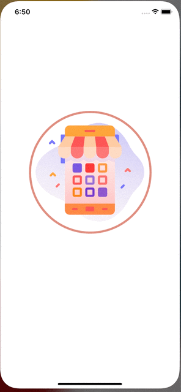

# Market app (iOS)

Course project to learn Swift. Small market application.

# Application preview

# What comes in app?

* Authentication
    * User registration / login / password recovery.
* Category
    * Can be created different categories (currently only via Firestore),
    * Can be created Items with following data:
        * Photo(up to 6),
        * Name,
        * Price,
        * Description.
    * Add Items to Basket.
* Search
    * Can perform search through all Items in Market by name/description.
* Basket
    * List of added Items,
    * Total price,
    * Option to pay by card.
* Profile
    * Change settings:
        * Name,
        * Surname,
        * Address.
    * Account status,
    * Purchase history,
    * Terms & Conditions.

# Built with
* FirebaseAuth - authentication,
* FirebaseFirestore - realtime data base,
* FirebaseStorage - manage stored files,
* Alamofire - HTTP networking library,
* Stripe - payment infrastructure,
* JGProgressHUD - simple progress HUD,
* InstantSearchClient(Algolia) - search engine for Firestore,
* Gallery - image picker.
